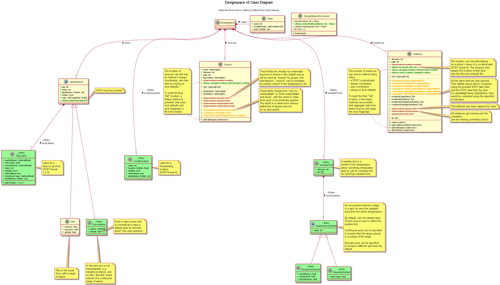

##############################
DesignSpaceDocument Python API
##############################

An object to read, write and edit interpolation systems for typefaces.
Define sources, axes, rules, variable fonts and instances.

Get an overview of the available classes in the Class Diagram below:

   UML class diagram of designspaceLib. Click to enlarge.

.. _designspacedocument-object:

DesignSpaceDocument object
==========================

.. autoclass:: fontTools.designspaceLib::DesignSpaceDocument
   :members:
   :undoc-members:
   :member-order: bysource

AxisDescriptor object
=====================

.. autoclass:: fontTools.designspaceLib::AxisDescriptor
   :members:
   :undoc-members:
   :inherited-members: SimpleDescriptor
   :member-order: bysource

DiscreteAxisDescriptor object
=============================

.. autoclass:: fontTools.designspaceLib::DiscreteAxisDescriptor
   :members:
   :undoc-members:
   :inherited-members: SimpleDescriptor
   :member-order: bysource

AxisLabelDescriptor object
==========================

.. autoclass:: fontTools.designspaceLib::AxisLabelDescriptor
   :members:
   :undoc-members:
   :member-order: bysource

LocationLabelDescriptor object
==========================

.. autoclass:: fontTools.designspaceLib::LocationLabelDescriptor
   :members:
   :undoc-members:
   :member-order: bysource

SourceDescriptor object
=======================

.. autoclass:: fontTools.designspaceLib::SourceDescriptor
   :members:
   :undoc-members:
   :member-order: bysource

VariableFontDescriptor object
=============================

.. autoclass:: fontTools.designspaceLib::VariableFontDescriptor
   :members:
   :undoc-members:
   :member-order: bysource

RangeAxisSubsetDescriptor object
================================

.. autoclass:: fontTools.designspaceLib::RangeAxisSubsetDescriptor
   :members:
   :undoc-members:
   :member-order: bysource

ValueAxisSubsetDescriptor object
================================

.. autoclass:: fontTools.designspaceLib::ValueAxisSubsetDescriptor
   :members:
   :undoc-members:
   :member-order: bysource

InstanceDescriptor object
=========================

.. autoclass:: fontTools.designspaceLib::InstanceDescriptor
   :members:
   :undoc-members:
   :member-order: bysource

RuleDescriptor object
=====================

.. autoclass:: fontTools.designspaceLib::RuleDescriptor
   :members:
   :undoc-members:
   :member-order: bysource

Evaluating rules
----------------

.. autofunction:: fontTools.designspaceLib::evaluateRule
.. autofunction:: fontTools.designspaceLib::evaluateConditions
.. autofunction:: fontTools.designspaceLib::processRules

.. _subclassing-descriptors:

Subclassing descriptors
=======================

The DesignSpaceDocument can take subclassed Reader and Writer objects.
This allows you to work with your own descriptors. You could subclass
the descriptors. But as long as they have the basic attributes the
descriptor does not need to be a subclass.

.. code:: python

    class MyDocReader(BaseDocReader):
        axisDescriptorClass = MyAxisDescriptor
        discreteAxisDescriptorClass = MyDiscreteAxisDescriptor
        axisLabelDescriptorClass = MyAxisLabelDescriptor
        locationLabelDescriptorClass = MyLocationLabelDescriptor
        sourceDescriptorClass = MySourceDescriptor
        variableFontsDescriptorClass = MyVariableFontDescriptor
        valueAxisSubsetDescriptorClass = MyValueAxisSubsetDescriptor
        rangeAxisSubsetDescriptorClass = MyRangeAxisSubsetDescriptor
        instanceDescriptorClass = MyInstanceDescriptor
        ruleDescriptorClass = MyRuleDescriptor

    class MyDocWriter(BaseDocWriter):
        axisDescriptorClass = MyAxisDescriptor
        discreteAxisDescriptorClass = MyDiscreteAxisDescriptor
        axisLabelDescriptorClass = MyAxisLabelDescriptor
        locationLabelDescriptorClass = MyLocationLabelDescriptor
        sourceDescriptorClass = MySourceDescriptor
        variableFontsDescriptorClass = MyVariableFontDescriptor
        valueAxisSubsetDescriptorClass = MyValueAxisSubsetDescriptor
        rangeAxisSubsetDescriptorClass = MyRangeAxisSubsetDescriptor
        instanceDescriptorClass = MyInstanceDescriptor
        ruleDescriptorClass = MyRuleDescriptor

    myDoc = DesignSpaceDocument(MyDocReader, MyDocWriter)
